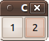

# Thinking Qt 1: general

This article shows one way to think about program
architecture when using the Qt library.
Because I use this program architecture also when using the
Wt library, this
article is very similar to 'Thinking Wt 1: general'.



## Overview

In the first two paragraph I will explain the rationale behind the
architecture proposed. The following paragraphs describes the steps in
implementing this architecture in a top-down way, followed by a
conclusion.

## Why these guidelines?

Qt is 'a cross-platform application and UI framework'. I
see many resemblances in its architecture with the Wt
library, suitable for, among others, web applications.
Due to their different running environments, Qt (desktop)
and Wt (web) are mutually exclusive. Because I enjoy
porting applications to as much platforms as possible, I have developed
some applications that use both (but not simultaneously) a
Qt and a Wt front-end. To be able to do this
easily, I follow the guidelines presented in this
article. Additionally, I like to reuse my own widgets
and dialogs in multiple applications, which is only possible with a
proper architecture.

Note that I follow the same guidelines for Wt front-ends.

## Architecture

The architecture, from biggest to smallest, is: main,
Qt::QApplication, dialog, widget:

 * Every C++ program has a single main
   function. The purpose of this main
   function is to create a
   Qt::QApplication and the first dialog.
   Optionally, main can parse the command-line arguments
 * The purpose of the Qt::QApplication is to
   manage signals. In this article
   I will not create a derived class of
   Qt::QApplication, but let main
   create the first dialog
 * A dialog is a collection of at least one widget. The purpose of a
   dialog is to respond to its widgets or creating other dialogs. A
   menu is an example of a dialog that creates other dialogs. A
   TicTacToe dialog would display a TicTacToe widget, but additionally
   shows the score, responding to a player winning and allowing the
   user to close it
 * A widget is a single visual element. The purpose of a widget is to
   repond to interaction and emitting signals when needed. For example,
   a TicTacToe widget responds to the clicking of the user and emits a
   signal when the game is finished. The signal might (or might not) be
   used by the dialog it is in

## Implementing main

In this example, main creates a single
Qt::QApplication, and creates the first (and only) dialog.

The most basic main function would
only call WRun with a createApplication function that
only returns a newly created
Qt::QApplication:


```
#include <QApplication>
#include "qtdialog.h"

int main(int argc, char *argv[])
{
  QApplication a(argc, argv);
  QtDialog w;
  w.show();
  return a.exec();
}
```
 
This code can be created by Qt Creator, by starting
a GUI application and instead of using a
Qt::QMainWindow called 'MainWindow', use a
Qt::QDialog called 'QtDialog'.

## Implementing the Qt::QApplication

In this article I will not
create a derived class of
Qt::QApplication, but let main
create the first dialog, as shown above.


## Implementing the dialog

Because a dialog is, well, a dialog, QtDialog is a derived
class of Qt::QDialog. QtDialog
manages two widgets, but does not respond to their signals.

## QtDialog.h

```
#ifndef QTDIALOG_H
#define QTDIALOG_H

#include <QDialog>

struct QtWidget;

class QtDialog : public QDialog
{
  Q_OBJECT

public:
  explicit QtDialog(QWidget *parent = 0);

private:
  QtWidget * const m_widget1;
  QtWidget * const m_widget2;
};

#endif // QTDIALOG_H
```

## QtDialog.cpp
 
```
#include "qtdialog.h"
#include "qtwidget.h"

QtDialog::QtDialog(QWidget *parent)
  : QDialog(parent),
    m_widget1(new QtWidget(this)),
    m_widget2(new QtWidget(this))
{
  m_widget1->setGeometry( 0,0,32,32);
  m_widget2->setGeometry(32,0,32,32);
}
```

Note that this class must be split in a header (.h)
file and an implementation (.cpp)
file. Putting both QtDialog's
declaration and definition in
a single header (.h) file will result in the link
error `undefined reference to 'vtable for
MyDialog'`.

Because the pointers `m_widget1` and `m_widget2` are set
to have their parent to 'this' in the QtDialog's constructor, these
should not be deleted (doing so results in a double
deletion).

## Implementing the widget

A widget is a single visual element. In this example, QtWidget is a
button (and thus a derived class of
Qt::QPushButton), that displays how often it is
clicked.

## QtWidget.h

```
#ifndef QTWIDGET_H
#define QTWIDGET_H

#include <QPushButton>

class QtWidget : public QPushButton
{
    Q_OBJECT
public:
  explicit QtWidget(QWidget *parent = 0);
  void mousePressEvent(QMouseEvent *);

  private:
  int m_count;
};

#endif // QTWIDGET_H
``` 

## QtWidget.h

```

#include "qtwidget.h"

QtWidget::QtWidget(QWidget *parent) :
  QPushButton(parent),
  m_count(0)
{

}

void QtWidget::mousePressEvent(QMouseEvent *)
{
  ++m_count;
  this->setText(QString::number(m_count));
}
```

## Running the Qt application

Click 'Build -&gt; Run' or CTRL-R to run the application.

## Conclusion

In this article I have shown one of many
Qt program architectures you can use, for a very basic
application. In my humble opinion, this architecture makes sense, but I
am open to discussion on this subject.


## References

  * 1. [Qt homepage](http://qt.nokia.com/products)

## Links

 * [HTML version](http://richelbilderbeek.nl/CppThinkingQt1.htm)
